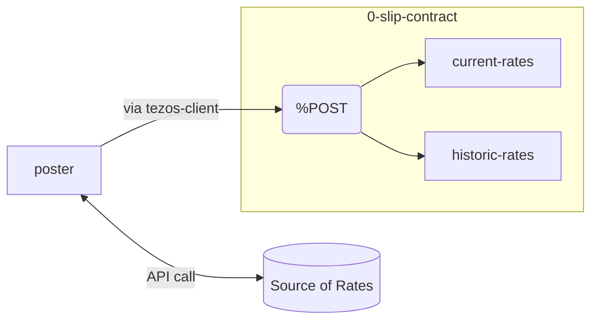
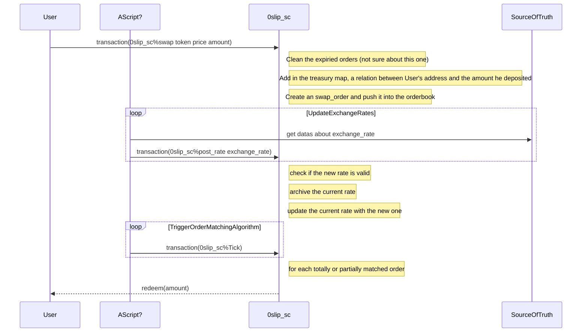

# Design document for the 0-slippage DEX POC

The aim of the 0-slippage dex is to enable users to deposit tokens for swap orders at the current Oracle price for a given pair.  The order will then be matched against an opposing order with no slippage in the price (up to a defined tolerance - +- 2bps).  If no order is found to totally fill the order (or partially fill) the order will be expired and the deposits returned.

The first PoC will be a very simple contract that will make the following assumptions/caveats.

- Only two pairs supported - XTZ/USDT and USDT/tzBTC
- No UI, contract will be originated and triggered using tezos-client
- Order book will not be visible
- Swap expiry will be static (this might change in later iterations)
- Tolerance is not included, swaps will only be exactly matched

## Exchange Rate Pricing Flow

For the initial PoC there will be a simple posting mechanism to supply the contract with current (Oracle type) exchange rates that will be used by the swap matching process.

A poster script/binary will periodically query a price source and post the rates to the contract. For the initial PoC the contract will keep a history of rates, this is purely for debugging during the PoC phase - this could be dropped at a later stage.



Exchange ratesare posted in the following format:

```json
{
  quote = {
    token_price = {
      token = {
        name = "XTZ";
      };
      value = 1;
      when = <timestamp>
    };
  };
  base = {
    token_price = {
      token = {
        name = "USDT";
        address = Some(("KT1XnTn74bUtxHfDtBmm2bGZAQfhPbvKWR8o" : address));
      };
      value = 1.90;
      when = <timestamp>
    };
  }
}
```


## Swap Order Flow

A swap order can be place don the contract by depositing the token (or XTZ) that is required to be swapped.  The swap order remains in existence up until a predefined expiry from the point the order was placed or until a partial or matching order is found.

As there is no UI for the simple PoC, all swap order will be placed via the tezos-client.

### Total match

If an exact 'total' matched order is found the matching code triggers the redemption of the tokens in opposing directions from the treasury so it fulfils the swap orders.

### Partial match

If a partial match is found, a partial redemption is triggered from the treasury to fulfil the swap orders.  Any remained swap amount remains and will go through future match cycles in order to try to match the remaining. If no match is found for the remaining amount, a redemption is triggered in the treasury to return the remaining amount to the user that placed the swap.

### No match

If no match is found by the time the swap order expires, a redemption will be triggered to return the deposited amount to the user that placed the swap.


### This document aim to describe the big picture, the worklow of the POC, ie the interactions between the differents actors, the available entrypoints etc.


