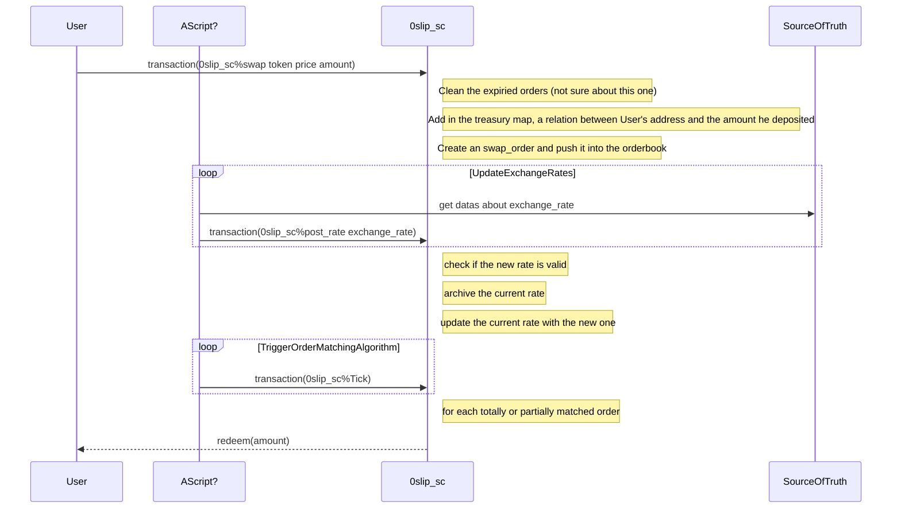

# Design document for the 0-slippage DEX POX

### This document aim to describe the big picture, the worklow of the POC, ie the interactions between the differents actors, the available entrypoints etc.

